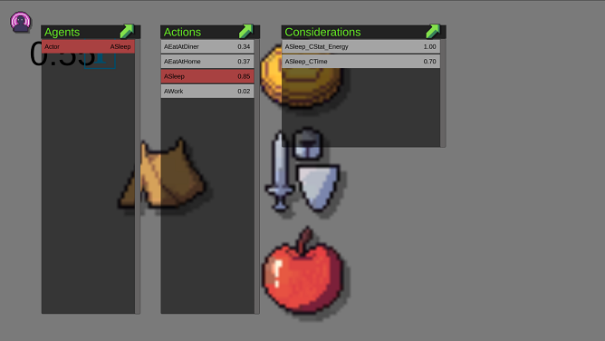

## UtilityAI
Utility-based AI systems in Unity(test 2020 or later).  

## FEATURES
* UtiliyAI Framwork  
* Test Scene  
* Monitor  

## HOW-TO-USE
1. Copy UtilityAI to your project directory. 
2. Add AgentAI componment to the object which you want AI control. 
3. Configure AIConfig.  
4. Add the UtilityAIMonitor Prefab to your project for tracking.  

## TODO
* AI Editor  
* Qualifier  
* Precondition  
* WIKI  

## DOC
[Choosing Effective Utility-Based Considerations](http://www.gameaipro.com/GameAIPro3/GameAIPro3_Chapter13_Choosing_Effective_Utility-Based_Considerations.pdf)  
[Behavior Decision System: Dragon Age Inquisition’s Utility Scoring Architecture](http://www.gameaipro.com/GameAIPro3/GameAIPro3_Chapter31_Behavior_Decision_System_Dragon_Age_Inquisition%E2%80%99s_Utility_Scoring_Architecture.pdf)  
[Dual-Utility Reasoning](http://www.gameaipro.com/GameAIPro2/GameAIPro2_Chapter03_Dual-Utility_Reasoning.pdf)  
[An Introduction to Utility Theory](http://www.gameaipro.com/GameAIPro/GameAIPro_Chapter09_An_Introduction_to_Utility_Theory.pdf)  
[Building Utility Decisions into Your Existing Behavior Tree](http://www.gameaipro.com/GameAIPro/GameAIPro_Chapter10_Building_Utility_Decisions_into_Your_Existing_Behavior_Tree.pdf)  
[Choosing Effective Utility-Based Considerations](http://www.gameaipro.com/GameAIPro3/GameAIPro3_Chapter13_Choosing_Effective_Utility-Based_Considerations.pdf)  

## OPEN-SOURCE
[utility-ai](https://github.com/Bartvanderkruys/utility-ai)   
[UtilityAI](https://github.com/OneManMonkeySquad/UtilityAI)  
[ReflexityAI](https://github.com/FBast/ReflexityAI)  
[CrystalAI](https://github.com/igiagkiozis/CrystalAI)  
[Apex-Game-Tools](https://github.com/ApexGameTools/Apex-Game-Tools)  
[UtilityAIEditor](https://github.com/zhl-dru/UtilityAIEditor)  

